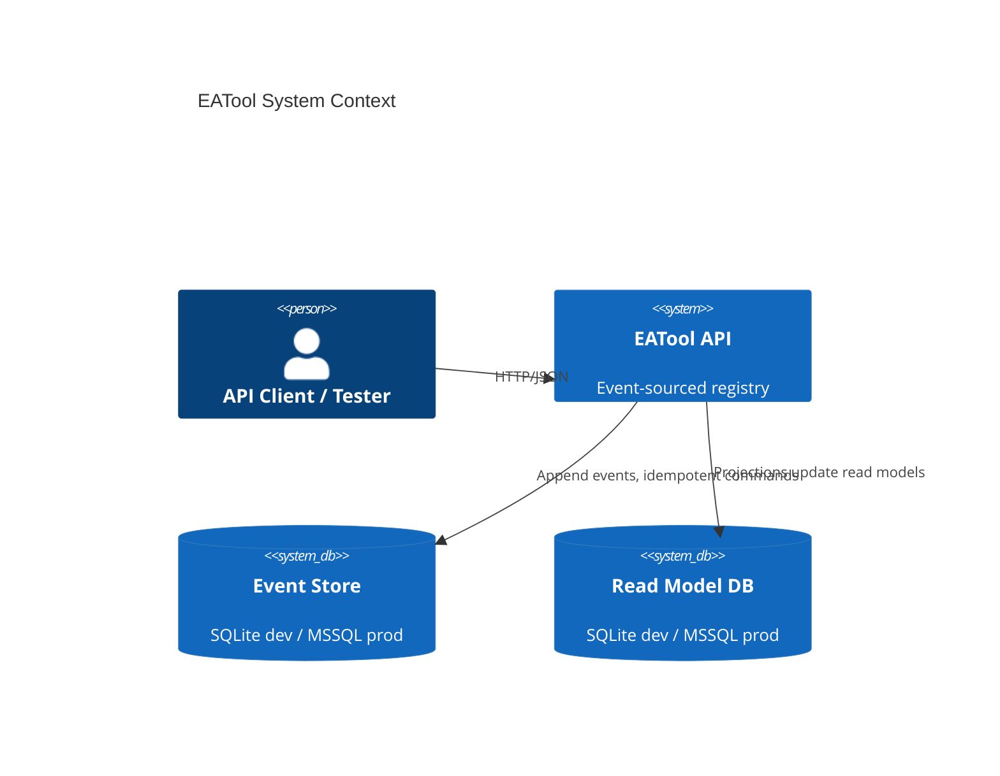
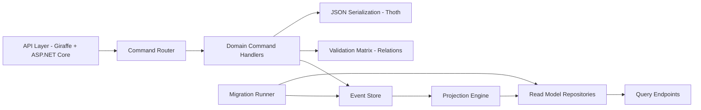
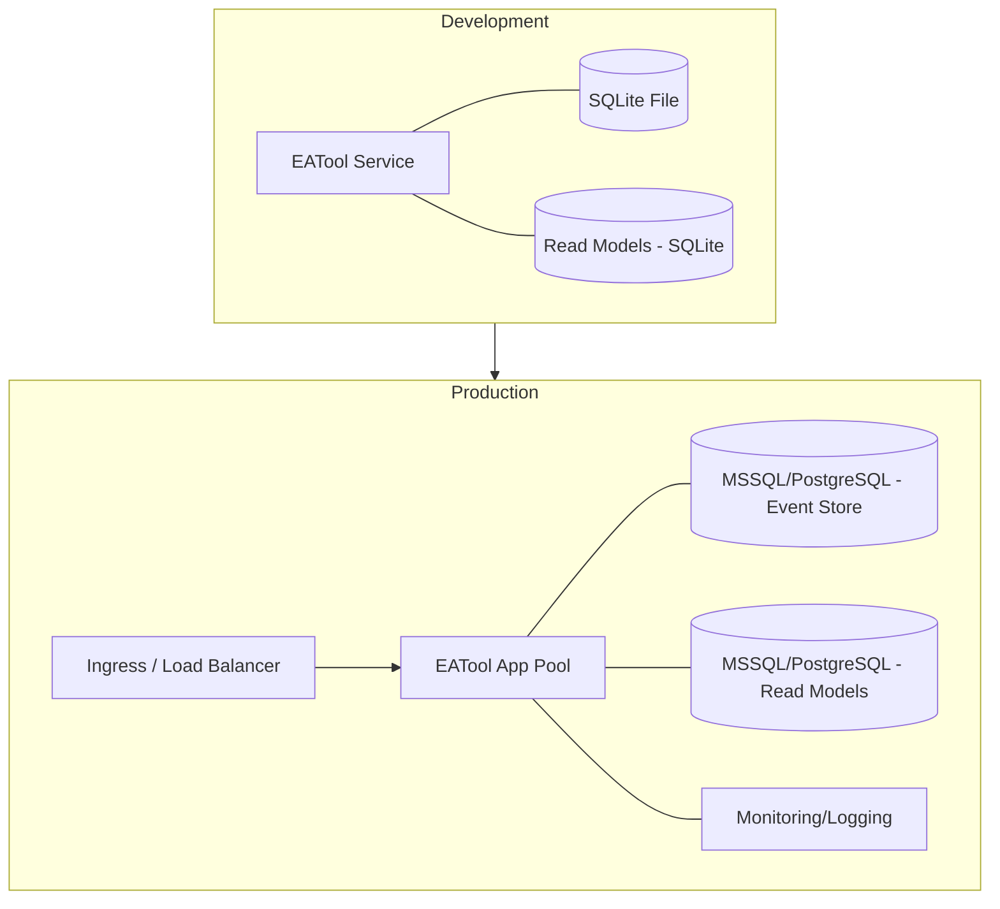
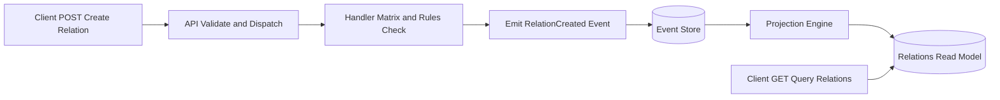
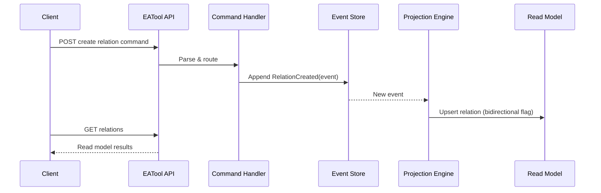
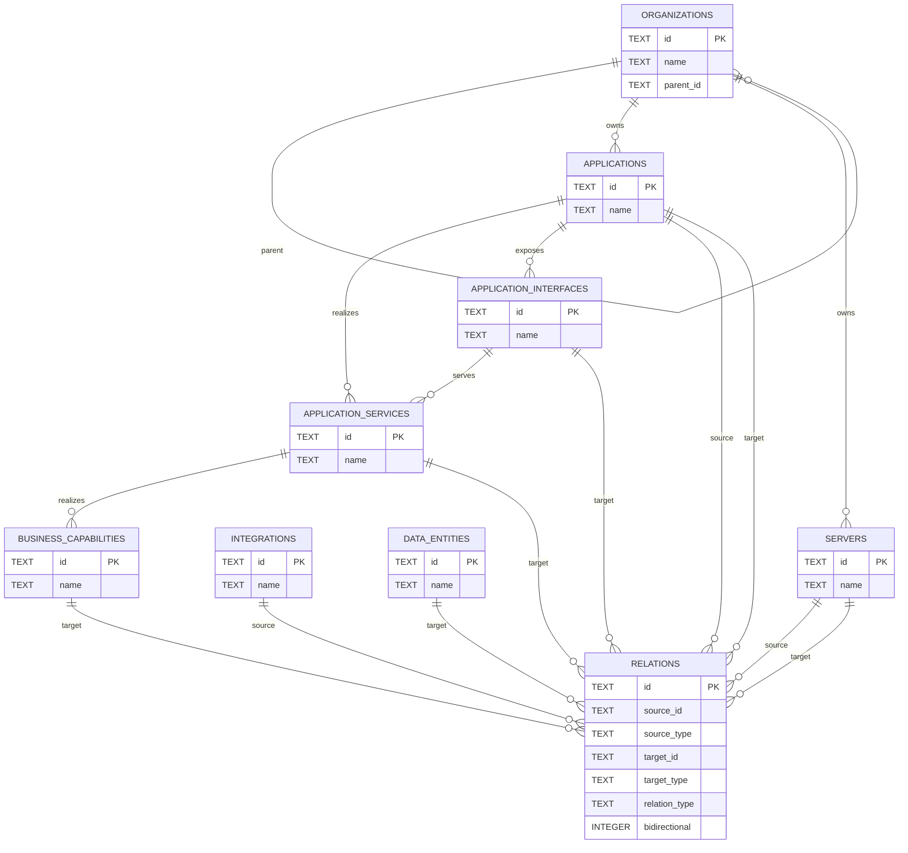

# EATool - Architecture Plan

## Executive Summary
EATool is an event-sourced, CQRS-based enterprise architecture registry. It exposes REST endpoints (F#/.NET) for managing domain entities (Applications, Organizations, Business Capabilities, Servers, Integrations, Data Entities) and their Relations. Writes produce domain events persisted to an Event Store; projections update read models for query endpoints. Development uses SQLite; production will adopt MSSQL/PostgreSQL. The architecture prioritizes clarity, consistency, and evolvability.

## System Context

Overview: Shows the EATool API interacting with clients and persistence layers.
- Key Components: `EATool API`, `Event Store`, `Read Model DB`.
- Relationships: Clients call HTTP endpoints; API appends events to Event Store; Projection engine updates Read Model DB.
- Design Decisions: Event sourcing for auditability and flexibility; CQRS for separation of reads/writes.
- NFR Considerations:
  - Scalability: Horizontal scale read side; partition event streams.
  - Performance: Fast reads via read models; append-only writes.
  - Security: AuthZ/AuthN (future), least privilege DB access.
  - Reliability: Idempotent commands; versioned events; projection checkpointing.
  - Maintainability: Clear boundaries; schema-evolution via events.
- Trade-offs: Added complexity for event sourcing vs simpler CRUD.
- Risks/Mitigations: Projection lag → checkpoint + replay; event versioning → strict schema evolution.

## Architecture Overview
Pattern: CQRS + Event Sourcing.
- Write path: Commands → Validation/Handlers → Events → Event Store.
- Read path: Projection engine → Read models → Query endpoints.
- Serialization: Thoth.Json for event payloads.
- Migrations: Forward-only SQL files; automated at startup.

## Component Architecture

Overview: Major components and dependencies.
- Component Responsibilities:
  - API Layer: HTTP routes; envelope parsing; error handling.
  - Command Router: Dispatches to domain handlers.
  - Command Handlers: Validate, produce events, enforce invariants (e.g., relation matrix).
  - Event Store: Persist events/commands/snapshots.
  - Projection Engine: Transforms events into read models.
  - Read Model Repositories: CRUD on read tables.
  - Migration Runner: Applies DB migrations.
- Communication: Synchronous in-process for dev; future async projections possible.
- Design Decisions: Keep handlers pure; write-side isolated from read-side schemas.
- NFRs: Modularity aids maintainability; repositories optimize queries.
- Trade-offs: Projections introduce eventual consistency.
- Risks: Schema drift → use projection_state tracking; serialization migration → event versioning.

## Deployment Architecture

Overview: Physical/logical deployment in dev vs prod.
- Environments: Dev (local SQLite); Prod (managed DB, containerized app).
- Network Boundaries: Ingress to app; DB in private subnet; role-based access.
- Deployment Strategy: Containers; rolling updates; migrations on startup.
- NFRs:
  - Scalability: Scale AppPool horizontally; isolate read DB for replicas.
  - Performance: Connection pooling; indexes on hot paths.
  - Security: TLS, secrets management, DB user separation.
  - Reliability: Health checks; backups; point-in-time recovery.
  - Maintainability: Infra-as-code; versioned migrations.
- Trade-offs: SQLite simplicity vs limited concurrency.
- Risks: Migration failures → pre-flight checks; connection limits → pooling.

## Data Flow

Overview: End-to-end write and read flows for Relations.
- Data Sources/Sinks: HTTP clients; Event Store; Read Models.
- Transformations: Validation → Event creation → Projection.
- Handling Strategy: Append-only events; projection idempotence; checkpointing.
- NFRs: Fast reads; durable writes; audit trail.
- Trade-offs: Eventual consistency between write and read.
- Risks: Incomplete projections → checkpoint replay; malformed events → strict decoders.

## Key Workflows

Overview: Create relation sequence.
- Ordering: Command → Event → Projection → Query.
- Request/Response: Synchronous write; eventually consistent read.
- NFRs: Idempotent commands; version checks; projection checkpoints.
- Trade-offs: Immediate read-after-write may lag.
- Risks: Concurrency conflicts → aggregate versioning.

## Additional Diagrams

### ERD (Read Models)

Overview: Key read model entities and relationships.
- Design Decisions: Organization hierarchy via `parent_id`; ownership via org→{app,server}; relations drive cross-entity links.
- NFRs: Indexes on `source_id`, `target_id`, `relation_type` for performance.
- Trade-offs: Minimal FKs for flexibility; rely on projections for integrity.
- Risks: Orphaned references → validation in handlers and projections.

## Phased Development

### Phase 1: Initial Implementation
- Single service; in-process projections; SQLite dev DB.
- Event store and projection_state tables present; snapshots optional.
- Strict relation matrix enforcement.

### Phase 2+: Final Architecture (Target)
- Managed RDBMS (MSSQL/PG) for event store and read models.
- Horizontal scaling; async projection workers; snapshotting strategy.
- Enhanced observability; RBAC; API gateway.

### Migration Path
- Introduce DB abstraction for MSSQL/PG.
- Externalize projection engine with durable queue (if needed).
- Add event upcasting/versioning policies.

## Non-Functional Requirements Analysis

### Scalability
- Scale read side via DB replicas; partition event streams.
- Stateless API instances; container orchestration.

### Performance
- Indexing: `aggregate_id, aggregate_version`, `event_type`, timestamps; on relations: `source_id`, `target_id`, `relation_type`.
- Connection pooling; prepared statements.

### Security
- Planned: OAuth2/OIDC; role-based authorization.
- DB users with least privilege; encrypted connections.

### Reliability
- Event store durability; backups and PITR.
- Health checks; projection checkpoints; retry policies.

### Maintainability
- Modular components; clear schemas; forward-only migrations.
- Documentation-driven schemas and event contracts.

## Risks and Mitigations
- Projection lag: checkpointing + monitoring + replay.
- Event schema evolution: versioning + upcasting.
- DB migration failure: pre-checks + roll-forward fixes.
- Concurrency conflicts: aggregate version checks + retries.

## Technology Stack Recommendations
- Runtime: .NET 8/10 (F#), Giraffe/ASP.NET Core.
- Persistence: SQLite (dev), MSSQL/PostgreSQL (prod).
- Serialization: Thoth.Json (events), JSON over HTTP.
- Observability: OpenTelemetry (future), structured logs.

## Next Steps
- Finalize `spec/spec-architecture-data.md` with detailed schemas.
- Add security and observability roadmap.
- Validate indexing coverage with production datasets.
