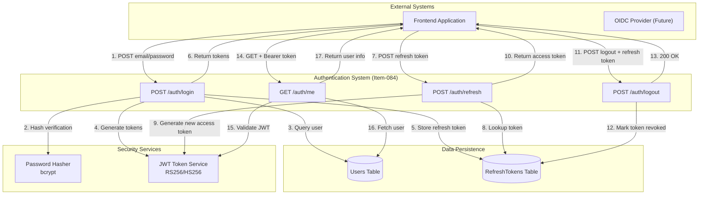
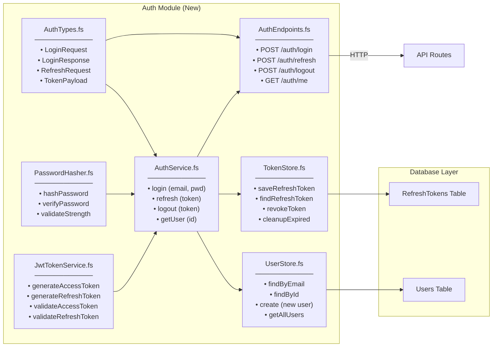
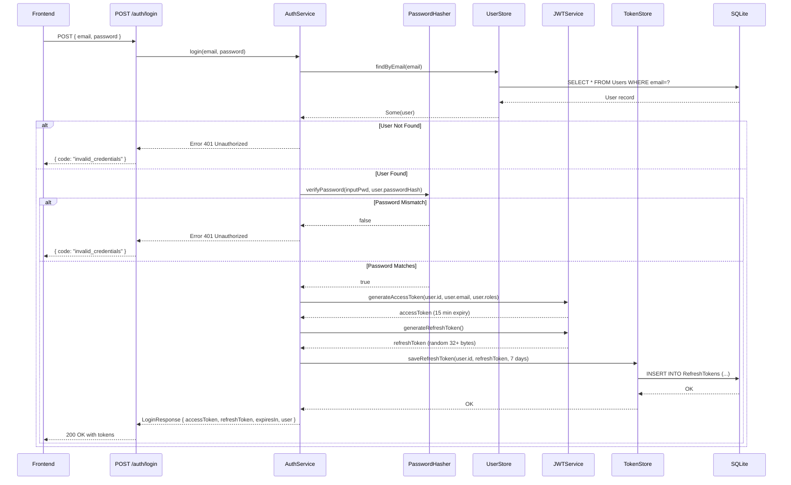
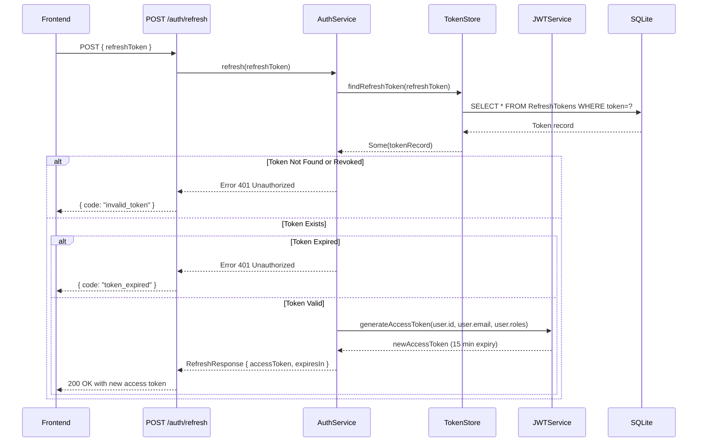
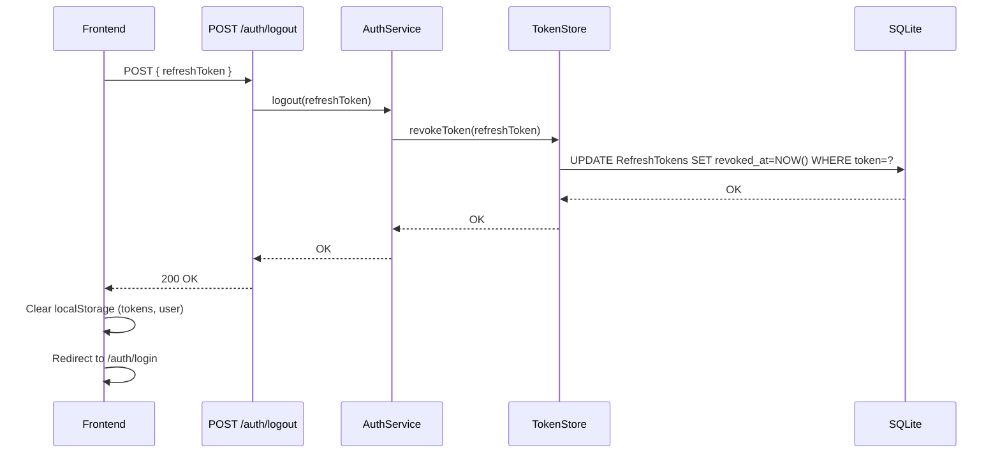
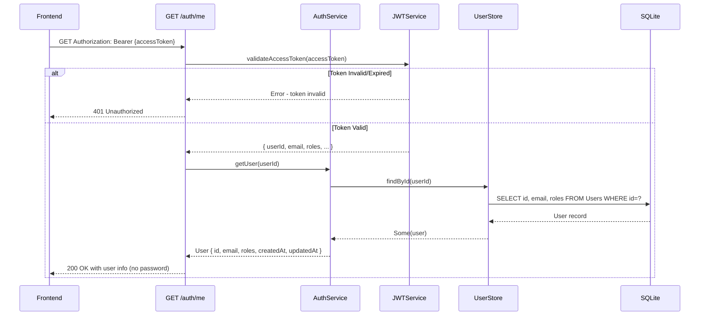

# Item-084: Authentication Endpoints - Implementation Architecture Guide

## Executive Summary

This document provides comprehensive architectural guidance for implementing Item-084 (Backend Authentication Endpoints). It defines the system design, component structure, data flows, security controls, and implementation patterns needed to deliver POST `/auth/login`, POST `/auth/refresh`, POST `/auth/logout`, and GET `/auth/me` endpoints.

**Key Deliverables**: 7 F# modules + 2 database migrations + 2 test files

**Estimated Effort**: 24-32 hours

**Timeline**: 4-5 business days

---

## 1. System Context Diagram



### System Boundaries
- **Authentication System**: Isolated auth modules handling credential verification and token lifecycle
- **Data Store**: SQLite with two new tables (Users, RefreshTokens)
- **Security Services**: Cryptographic operations (password hashing, token generation/validation)
- **Frontend Integration**: REST API consuming auth endpoints

---

## 2. Component Architecture Diagram



### Component Responsibilities

| Component | Purpose | Key Methods |
|-----------|---------|------------|
| **AuthTypes.fs** | Domain types for auth | Request/response types, token claims |
| **PasswordHasher.fs** | Secure password handling | Hash, verify, validate strength |
| **JwtTokenService.fs** | Token generation/validation | Create JWTs, parse claims, validate |
| **AuthService.fs** | Business logic orchestration | Login, refresh, logout workflows |
| **UserStore.fs** | User persistence | Query/create users in database |
| **TokenStore.fs** | Refresh token lifecycle | Store, lookup, revoke tokens |
| **AuthEndpoints.fs** | HTTP request handlers | Map requests to AuthService |

### Integration Points with Existing System
- **Program.fs**: Register auth routes and services
- **Middleware**: No changes needed (error handling exists)
- **Database.fs**: Reuse existing connection pool
- **Migrations.fs**: Add new migrations automatically

---

## 3. Data Flow Diagrams

### 3.1 Login Flow



### 3.2 Refresh Token Flow



### 3.3 Logout Flow



### 3.4 Get Current User (Me) Flow



---

## 4. Database Schema

### 4.1 Users Table

```sql
CREATE TABLE Users (
    id TEXT PRIMARY KEY,                    -- UUID
    email TEXT NOT NULL UNIQUE,             -- user@example.com
    password_hash TEXT NOT NULL,            -- bcrypt hash
    password_salt TEXT NOT NULL,            -- bcrypt salt
    roles TEXT NOT NULL,                    -- JSON array: ["Viewer", "Admin"]
    status TEXT NOT NULL DEFAULT 'active',  -- active | locked | suspended
    created_at TEXT NOT NULL,               -- ISO8601 UTC
    updated_at TEXT NOT NULL,               -- ISO8601 UTC
    last_login_at TEXT                      -- ISO8601 UTC (nullable)
);

CREATE UNIQUE INDEX idx_users_email ON Users(email);
```

### 4.2 RefreshTokens Table

```sql
CREATE TABLE RefreshTokens (
    id TEXT PRIMARY KEY,                    -- UUID
    user_id TEXT NOT NULL,                  -- Foreign key to Users.id
    token_hash TEXT NOT NULL UNIQUE,        -- Hash of token (never store plain)
    expires_at TEXT NOT NULL,               -- ISO8601 UTC
    revoked_at TEXT,                        -- ISO8601 UTC (nullable)
    created_at TEXT NOT NULL,               -- ISO8601 UTC
    FOREIGN KEY (user_id) REFERENCES Users(id)
);

CREATE INDEX idx_refresh_tokens_user_id ON RefreshTokens(user_id);
CREATE INDEX idx_refresh_tokens_expires_at ON RefreshTokens(expires_at);
```

### 4.3 Migration Files

**File: `src/Infrastructure/Migrations/014_create_users_table.sql`**
```sql
-- Create Users table for authentication
CREATE TABLE IF NOT EXISTS Users (
    id TEXT PRIMARY KEY,
    email TEXT NOT NULL UNIQUE,
    password_hash TEXT NOT NULL,
    password_salt TEXT NOT NULL,
    roles TEXT NOT NULL DEFAULT '[]',
    status TEXT NOT NULL DEFAULT 'active',
    created_at TEXT NOT NULL,
    updated_at TEXT NOT NULL,
    last_login_at TEXT
);

CREATE UNIQUE INDEX IF NOT EXISTS idx_users_email ON Users(email);
```

**File: `src/Infrastructure/Migrations/015_create_refresh_tokens_table.sql`**
```sql
-- Create RefreshTokens table for token management
CREATE TABLE IF NOT EXISTS RefreshTokens (
    id TEXT PRIMARY KEY,
    user_id TEXT NOT NULL,
    token_hash TEXT NOT NULL UNIQUE,
    expires_at TEXT NOT NULL,
    revoked_at TEXT,
    created_at TEXT NOT NULL,
    FOREIGN KEY (user_id) REFERENCES Users(id) ON DELETE CASCADE
);

CREATE INDEX IF NOT EXISTS idx_refresh_tokens_user_id ON RefreshTokens(user_id);
CREATE INDEX IF NOT EXISTS idx_refresh_tokens_expires_at ON RefreshTokens(expires_at);
```

**File: `src/Infrastructure/Migrations/016_seed_development_users.sql`**
```sql
-- Seed development users (development environment only)
-- Run with environment guard: only execute if ASPNETCORE_ENVIRONMENT = 'development'

-- Password for both: Password123!
-- Hash: $2a$10$abc... (bcrypt, 10 rounds)
-- These should be replaced in production

INSERT OR IGNORE INTO Users (id, email, password_hash, password_salt, roles, status, created_at, updated_at)
VALUES 
    ('user-admin-001', 'admin@example.com', '$2a$10$abc...xyz', 'salt', '["Admin"]', 'active', datetime('now'), datetime('now')),
    ('user-viewer-001', 'user@example.com', '$2a$10$def...uvw', 'salt', '["Viewer"]', 'active', datetime('now'), datetime('now'));
```

---

## 5. Component Specifications

### 5.1 AuthTypes.fs - Domain Types

```fsharp
// Domain types for authentication system

namespace EATool.Auth

open System

// Request types
type LoginRequest = {
    email: string
    password: string
}

type RefreshTokenRequest = {
    refreshToken: string
}

type LogoutRequest = {
    refreshToken: string
}

// Response types
type UserInfo = {
    id: string
    email: string
    roles: string list
    createdAt: DateTime
}

type LoginResponse = {
    accessToken: string
    refreshToken: string
    expiresIn: int  // seconds (900 for 15 min)
    user: UserInfo
}

type RefreshTokenResponse = {
    accessToken: string
    expiresIn: int  // seconds (900 for 15 min)
}

// Internal domain types
type User = {
    id: string
    email: string
    passwordHash: string
    passwordSalt: string
    roles: string list
    status: string  // "active" | "locked" | "suspended"
    createdAt: DateTime
    updatedAt: DateTime
    lastLoginAt: DateTime option
}

type RefreshToken = {
    id: string
    userId: string
    tokenHash: string  // Hash of token, never plain
    expiresAt: DateTime
    revokedAt: DateTime option
    createdAt: DateTime
}

type JwtClaims = {
    sub: string  // user id
    email: string
    roles: string list
    iat: int64   // issued at (unix timestamp)
    exp: int64   // expiration (unix timestamp)
    jti: string  // jwt id (unique identifier)
}

type TokenValidationResult =
    | Valid of JwtClaims
    | Expired
    | Invalid
    | NotFound
```

### 5.2 PasswordHasher.fs - Password Security

```fsharp
// Password hashing and validation using bcrypt

namespace EATool.Auth

open System
open BCrypt.Net

module PasswordHasher =
    
    // Constants
    [<Literal>]
    let private WORK_FACTOR = 10  // bcrypt rounds
    
    [<Literal>]
    let private MIN_LENGTH = 8
    
    // Hash a password with bcrypt
    let hashPassword (password: string) : Result<string * string, string> =
        try
            let salt = BCrypt.GenerateSalt(WORK_FACTOR)
            let hash = BCrypt.HashPassword(password, salt)
            Ok (hash, salt)
        with ex ->
            Error $"Password hashing failed: {ex.Message}"
    
    // Verify password against hash
    let verifyPassword (password: string) (hash: string) : bool =
        try
            BCrypt.Verify(password, hash)
        with
            | _ -> false
    
    // Validate password strength
    let validatePasswordStrength (password: string) : Result<unit, string list> =
        let errors = [
            if String.IsNullOrWhiteSpace password then
                "Password cannot be empty"
            if password.Length < MIN_LENGTH then
                $"Password must be at least {MIN_LENGTH} characters"
            if not (password |> Seq.exists Char.IsUpper) then
                "Password must contain at least one uppercase letter"
            if not (password |> Seq.exists Char.IsLower) then
                "Password must contain at least one lowercase letter"
            if not (password |> Seq.exists Char.IsDigit) then
                "Password must contain at least one digit"
        ]
        
        if List.isEmpty errors then Ok ()
        else Error errors
```

### 5.3 JwtTokenService.fs - Token Management

```fsharp
// JWT token generation and validation

namespace EATool.Auth

open System
open System.IdentityModel.Tokens.Jwt
open Microsoft.IdentityModel.Tokens
open System.Text

module JwtTokenService =
    
    // Configuration (from environment)
    let private getJwtSecret () =
        System.Environment.GetEnvironmentVariable("JWT_SECRET")
        |> Option.ofObj
        |> Option.defaultValue "dev-secret-key-change-in-production"
    
    let private getAccessTokenExpiry () =
        System.Environment.GetEnvironmentVariable("JWT_EXPIRY_MINUTES")
        |> Option.ofObj
        |> Option.bind (fun s -> if Int32.TryParse s |> fst then Some s else None)
        |> Option.defaultValue "15"
        |> Int32.Parse
    
    let private getRefreshTokenExpiry () =
        System.Environment.GetEnvironmentVariable("JWT_REFRESH_EXPIRY_DAYS")
        |> Option.ofObj
        |> Option.bind (fun s -> if Int32.TryParse s |> fst then Some s else None)
        |> Option.defaultValue "7"
        |> Int32.Parse
    
    // Create security key
    let private createSecurityKey () =
        let secret = getJwtSecret()
        let key = Encoding.ASCII.GetBytes(secret)
        SymmetricSecurityKey(key)
    
    // Generate access token (JWT)
    let generateAccessToken (userId: string) (email: string) (roles: string list) : string =
        let securityKey = createSecurityKey()
        let credentials = SigningCredentials(securityKey, SecurityAlgorithms.HmacSha256)
        
        let now = DateTime.UtcNow
        let expiry = now.AddMinutes(float (getAccessTokenExpiry()))
        
        let claims = [
            System.Security.Claims.Claim(ClaimTypes.NameIdentifier, userId)
            System.Security.Claims.Claim(ClaimTypes.Email, email)
            System.Security.Claims.Claim("jti", Guid.NewGuid().ToString())
        ] @ (roles |> List.map (fun role -> 
            System.Security.Claims.Claim(ClaimTypes.Role, role)
        ))
        
        let token = JwtSecurityToken(
            issuer = "eatool",
            audience = "eatool-api",
            claims = claims,
            notBefore = now,
            expires = expiry,
            signingCredentials = credentials
        )
        
        JwtSecurityTokenHandler().WriteToken(token)
    
    // Generate refresh token (cryptographic random)
    let generateRefreshToken () : string =
        let randomBytes = Array.zeroCreate 32
        use rng = System.Security.Cryptography.RandomNumberGenerator.Create()
        rng.GetBytes(randomBytes)
        Convert.ToBase64String(randomBytes)
    
    // Validate access token
    let validateAccessToken (token: string) : TokenValidationResult =
        try
            let handler = JwtSecurityTokenHandler()
            let securityKey = createSecurityKey()
            
            let validationParameters = TokenValidationParameters(
                ValidateIssuerSigningKey = true,
                IssuerSigningKey = securityKey,
                ValidateIssuer = true,
                ValidIssuer = "eatool",
                ValidateAudience = true,
                ValidAudience = "eatool-api",
                ValidateLifetime = true,
                ClockSkew = TimeSpan.FromSeconds(60.0)
            )
            
            let principal = handler.ValidateToken(token, validationParameters)
            
            let sub = principal.Claims |> Seq.tryFind (fun c -> c.Type = ClaimTypes.NameIdentifier)
            let email = principal.Claims |> Seq.tryFind (fun c -> c.Type = ClaimTypes.Email)
            let roles = principal.Claims 
                        |> Seq.filter (fun c -> c.Type = ClaimTypes.Role)
                        |> Seq.map (fun c -> c.Value)
                        |> Seq.toList
            
            match (sub, email) with
            | Some subClaim, Some emailClaim ->
                let claims = {
                    sub = subClaim.Value
                    email = emailClaim.Value
                    roles = roles
                    iat = int64 (DateTime.UtcNow.Subtract(DateTime(1970,1,1)).TotalSeconds)
                    exp = int64 0  // Not used for validation
                    jti = ""
                }
                Valid claims
            | _ -> Invalid
        with
        | :? SecurityTokenExpiredException -> Expired
        | :? SecurityTokenValidationException -> Invalid
        | _ -> Invalid
```

### 5.4 UserStore.fs - User Persistence

```fsharp
// User database operations

namespace EATool.Auth

open System
open Microsoft.Data.Sqlite

module UserStore =
    
    let private getConnectionString () =
        System.Environment.GetEnvironmentVariable("CONNECTION_STRING")
        |> Option.ofObj
        |> Option.defaultValue "Data Source=eatool.db"
    
    // Find user by email
    let findByEmail (email: string) : Result<User option, string> =
        try
            use connection = new SqliteConnection(getConnectionString())
            connection.Open()
            
            use command = connection.CreateCommand()
            command.CommandText <- "
                SELECT id, email, password_hash, password_salt, roles, status, created_at, updated_at, last_login_at
                FROM Users
                WHERE email = @email
            "
            command.Parameters.AddWithValue("@email", email) |> ignore
            
            use reader = command.ExecuteReader()
            if reader.Read() then
                let roles = 
                    reader.GetString(4)
                    |> Thoth.Json.Net.Decode.fromString (Thoth.Json.Net.Decode.list Thoth.Json.Net.Decode.string)
                    |> function Ok r -> r | Error _ -> []
                
                let user = {
                    id = reader.GetString(0)
                    email = reader.GetString(1)
                    passwordHash = reader.GetString(2)
                    passwordSalt = reader.GetString(3)
                    roles = roles
                    status = reader.GetString(5)
                    createdAt = DateTime.Parse(reader.GetString(6))
                    updatedAt = DateTime.Parse(reader.GetString(7))
                    lastLoginAt = if reader.IsDBNull(8) then None else Some (DateTime.Parse(reader.GetString(8)))
                }
                Ok (Some user)
            else
                Ok None
        with ex ->
            Error $"Failed to find user by email: {ex.Message}"
    
    // Find user by ID
    let findById (userId: string) : Result<User option, string> =
        try
            use connection = new SqliteConnection(getConnectionString())
            connection.Open()
            
            use command = connection.CreateCommand()
            command.CommandText <- "
                SELECT id, email, password_hash, password_salt, roles, status, created_at, updated_at, last_login_at
                FROM Users
                WHERE id = @id
            "
            command.Parameters.AddWithValue("@id", userId) |> ignore
            
            use reader = command.ExecuteReader()
            if reader.Read() then
                let roles = 
                    reader.GetString(4)
                    |> Thoth.Json.Net.Decode.fromString (Thoth.Json.Net.Decode.list Thoth.Json.Net.Decode.string)
                    |> function Ok r -> r | Error _ -> []
                
                let user = {
                    id = reader.GetString(0)
                    email = reader.GetString(1)
                    passwordHash = reader.GetString(2)
                    passwordSalt = reader.GetString(3)
                    roles = roles
                    status = reader.GetString(5)
                    createdAt = DateTime.Parse(reader.GetString(6))
                    updatedAt = DateTime.Parse(reader.GetString(7))
                    lastLoginAt = if reader.IsDBNull(8) then None else Some (DateTime.Parse(reader.GetString(8)))
                }
                Ok (Some user)
            else
                Ok None
        with ex ->
            Error $"Failed to find user by ID: {ex.Message}"
```

### 5.5 TokenStore.fs - Refresh Token Lifecycle

```fsharp
// Refresh token database operations

namespace EATool.Auth

open System
open Microsoft.Data.Sqlite

module TokenStore =
    
    let private getConnectionString () =
        System.Environment.GetEnvironmentVariable("CONNECTION_STRING")
        |> Option.ofObj
        |> Option.defaultValue "Data Source=eatool.db"
    
    // Hash refresh token for storage
    let private hashToken (token: string) : string =
        use sha256 = System.Security.Cryptography.SHA256.Create()
        token
        |> System.Text.Encoding.UTF8.GetBytes
        |> sha256.ComputeHash
        |> Convert.ToBase64String
    
    // Save refresh token
    let saveRefreshToken (userId: string) (token: string) (expiryDays: int) : Result<unit, string> =
        try
            let tokenHash = hashToken token
            let expiresAt = DateTime.UtcNow.AddDays(float expiryDays)
            
            use connection = new SqliteConnection(getConnectionString())
            connection.Open()
            
            use command = connection.CreateCommand()
            command.CommandText <- "
                INSERT INTO RefreshTokens (id, user_id, token_hash, expires_at, created_at)
                VALUES (@id, @user_id, @token_hash, @expires_at, @created_at)
            "
            command.Parameters.AddWithValue("@id", Guid.NewGuid().ToString()) |> ignore
            command.Parameters.AddWithValue("@user_id", userId) |> ignore
            command.Parameters.AddWithValue("@token_hash", tokenHash) |> ignore
            command.Parameters.AddWithValue("@expires_at", expiresAt) |> ignore
            command.Parameters.AddWithValue("@created_at", DateTime.UtcNow) |> ignore
            
            command.ExecuteNonQuery() |> ignore
            Ok ()
        with ex ->
            Error $"Failed to save refresh token: {ex.Message}"
    
    // Find and validate refresh token
    let findRefreshToken (token: string) : Result<RefreshToken option, string> =
        try
            let tokenHash = hashToken token
            
            use connection = new SqliteConnection(getConnectionString())
            connection.Open()
            
            use command = connection.CreateCommand()
            command.CommandText <- "
                SELECT id, user_id, token_hash, expires_at, revoked_at, created_at
                FROM RefreshTokens
                WHERE token_hash = @token_hash
            "
            command.Parameters.AddWithValue("@token_hash", tokenHash) |> ignore
            
            use reader = command.ExecuteReader()
            if reader.Read() then
                let refreshToken = {
                    id = reader.GetString(0)
                    userId = reader.GetString(1)
                    tokenHash = reader.GetString(2)
                    expiresAt = DateTime.Parse(reader.GetString(3))
                    revokedAt = if reader.IsDBNull(4) then None else Some (DateTime.Parse(reader.GetString(4)))
                    createdAt = DateTime.Parse(reader.GetString(5))
                }
                Ok (Some refreshToken)
            else
                Ok None
        with ex ->
            Error $"Failed to find refresh token: {ex.Message}"
    
    // Revoke a refresh token
    let revokeToken (token: string) : Result<unit, string> =
        try
            let tokenHash = hashToken token
            
            use connection = new SqliteConnection(getConnectionString())
            connection.Open()
            
            use command = connection.CreateCommand()
            command.CommandText <- "
                UPDATE RefreshTokens
                SET revoked_at = @revoked_at
                WHERE token_hash = @token_hash
            "
            command.Parameters.AddWithValue("@revoked_at", DateTime.UtcNow) |> ignore
            command.Parameters.AddWithValue("@token_hash", tokenHash) |> ignore
            
            command.ExecuteNonQuery() |> ignore
            Ok ()
        with ex ->
            Error $"Failed to revoke token: {ex.Message}"
```

### 5.6 AuthService.fs - Business Logic

```fsharp
// Authentication business logic orchestration

namespace EATool.Auth

open System

module AuthService =
    
    // Login: verify credentials and issue tokens
    let login (email: string) (password: string) : Async<Result<LoginResponse, string>> = async {
        // Validate inputs
        let! user = UserStore.findByEmail email |> Async.AwaitTask |> Async.Catch 
                    |> function 
                       | Choice1Of2 (Ok (Some u)) -> async { return Ok u }
                       | Choice1Of2 (Ok None) -> async { return Error "Invalid credentials" }
                       | Choice1Of2 (Error e) -> async { return Error e }
                       | Choice2Of2 ex -> async { return Error ex.Message }
        
        match user with
        | Ok foundUser ->
            // Verify password
            if PasswordHasher.verifyPassword password foundUser.passwordHash then
                // Check account status
                if foundUser.status <> "active" then
                    return Error "Account is not active"
                else
                    // Generate tokens
                    let accessToken = JwtTokenService.generateAccessToken foundUser.id foundUser.email foundUser.roles
                    let refreshToken = JwtTokenService.generateRefreshToken()
                    
                    // Save refresh token to database
                    let! saveResult = TokenStore.saveRefreshToken foundUser.id refreshToken 7 
                                     |> Async.AwaitTask
                                     |> Async.Catch
                                     |> function
                                        | Choice1Of2 (Ok ()) -> async { return Ok () }
                                        | Choice1Of2 (Error e) -> async { return Error e }
                                        | Choice2Of2 ex -> async { return Error ex.Message }
                    
                    match saveResult with
                    | Ok () ->
                        let response = {
                            accessToken = accessToken
                            refreshToken = refreshToken
                            expiresIn = 900  // 15 minutes
                            user = {
                                id = foundUser.id
                                email = foundUser.email
                                roles = foundUser.roles
                                createdAt = foundUser.createdAt
                            }
                        }
                        return Ok response
                    | Error err -> return Error err
            else
                return Error "Invalid credentials"
        | Error err -> return Error err
    }
    
    // Refresh: issue new access token using refresh token
    let refresh (refreshToken: string) : Async<Result<RefreshTokenResponse, string>> = async {
        let! tokenResult = TokenStore.findRefreshToken refreshToken 
                          |> Async.AwaitTask
                          |> Async.Catch
                          |> function
                             | Choice1Of2 (Ok (Some t)) -> async { return Ok t }
                             | Choice1Of2 (Ok None) -> async { return Error "Invalid token" }
                             | Choice1Of2 (Error e) -> async { return Error e }
                             | Choice2Of2 ex -> async { return Error ex.Message }
        
        match tokenResult with
        | Ok token ->
            // Check if token is revoked
            if token.revokedAt.IsSome then
                return Error "Token has been revoked"
            // Check if token is expired
            elif token.expiresAt < DateTime.UtcNow then
                return Error "Token has expired"
            else
                // Get user info
                let! userResult = UserStore.findById token.userId 
                                 |> Async.AwaitTask
                                 |> Async.Catch
                                 |> function
                                    | Choice1Of2 (Ok (Some u)) -> async { return Ok u }
                                    | Choice1Of2 (Ok None) -> async { return Error "User not found" }
                                    | Choice1Of2 (Error e) -> async { return Error e }
                                    | Choice2Of2 ex -> async { return Error ex.Message }
                
                match userResult with
                | Ok user ->
                    let newAccessToken = JwtTokenService.generateAccessToken user.id user.email user.roles
                    let response = {
                        accessToken = newAccessToken
                        expiresIn = 900  // 15 minutes
                    }
                    return Ok response
                | Error err -> return Error err
        | Error err -> return Error err
    }
    
    // Logout: revoke refresh token
    let logout (refreshToken: string) : Async<Result<unit, string>> = async {
        let! result = TokenStore.revokeToken refreshToken 
                     |> Async.AwaitTask
                     |> Async.Catch
                     |> function
                        | Choice1Of2 (Ok ()) -> async { return Ok () }
                        | Choice1Of2 (Error e) -> async { return Error e }
                        | Choice2Of2 ex -> async { return Error ex.Message }
        return result
    }
    
    // Get user by ID
    let getUser (userId: string) : Async<Result<UserInfo option, string>> = async {
        let! result = UserStore.findById userId 
                     |> Async.AwaitTask
                     |> Async.Catch
                     |> function
                        | Choice1Of2 (Ok (Some u)) -> async { 
                            return Ok (Some {
                                id = u.id
                                email = u.email
                                roles = u.roles
                                createdAt = u.createdAt
                            })
                        }
                        | Choice1Of2 (Ok None) -> async { return Ok None }
                        | Choice1Of2 (Error e) -> async { return Error e }
                        | Choice2Of2 ex -> async { return Error ex.Message }
        return result
    }
```

### 5.7 AuthEndpoints.fs - HTTP Handlers

```fsharp
// HTTP endpoint handlers for authentication

namespace EATool.Api

open Giraffe
open Thoth.Json.Net
open EATool.Auth
open Microsoft.AspNetCore.Http

module AuthEndpoints =
    
    // POST /auth/login
    let loginHandler : HttpHandler = fun next ctx -> task {
        try
            let! body = ctx.BindJsonAsync<LoginRequest>()
            
            // Validate input
            if System.String.IsNullOrWhiteSpace body.email || System.String.IsNullOrWhiteSpace body.password then
                ctx.SetStatusCode 400
                let errorJson = 
                    Encode.object [
                        "code", Encode.string "validation_error"
                        "message", Encode.string "Email and password are required"
                    ]
                return! json errorJson next ctx
            else
                let! result = AuthService.login body.email body.password
                
                match result with
                | Ok response ->
                    ctx.SetStatusCode 200
                    let responseJson =
                        Encode.object [
                            "accessToken", Encode.string response.accessToken
                            "refreshToken", Encode.string response.refreshToken
                            "expiresIn", Encode.int response.expiresIn
                            "user", Encode.object [
                                "id", Encode.string response.user.id
                                "email", Encode.string response.user.email
                                "roles", Encode.list (List.map Encode.string response.user.roles)
                                "createdAt", Encode.datetime response.user.createdAt
                            ]
                        ]
                    return! json responseJson next ctx
                    
                | Error err ->
                    ctx.SetStatusCode 401
                    let errorJson =
                        Encode.object [
                            "code", Encode.string "unauthorized"
                            "message", Encode.string err
                        ]
                    return! json errorJson next ctx
        with ex ->
            ctx.SetStatusCode 500
            let errorJson =
                Encode.object [
                    "code", Encode.string "internal_error"
                    "message", Encode.string "An error occurred"
                ]
            return! json errorJson next ctx
    }
    
    // POST /auth/refresh
    let refreshHandler : HttpHandler = fun next ctx -> task {
        try
            let! body = ctx.BindJsonAsync<RefreshTokenRequest>()
            
            if System.String.IsNullOrWhiteSpace body.refreshToken then
                ctx.SetStatusCode 400
                let errorJson =
                    Encode.object [
                        "code", Encode.string "validation_error"
                        "message", Encode.string "Refresh token is required"
                    ]
                return! json errorJson next ctx
            else
                let! result = AuthService.refresh body.refreshToken
                
                match result with
                | Ok response ->
                    ctx.SetStatusCode 200
                    let responseJson =
                        Encode.object [
                            "accessToken", Encode.string response.accessToken
                            "expiresIn", Encode.int response.expiresIn
                        ]
                    return! json responseJson next ctx
                    
                | Error err ->
                    ctx.SetStatusCode 401
                    let errorJson =
                        Encode.object [
                            "code", Encode.string "unauthorized"
                            "message", Encode.string err
                        ]
                    return! json errorJson next ctx
        with ex ->
            ctx.SetStatusCode 500
            let errorJson =
                Encode.object [
                    "code", Encode.string "internal_error"
                    "message", Encode.string "An error occurred"
                ]
            return! json errorJson next ctx
    }
    
    // POST /auth/logout
    let logoutHandler : HttpHandler = fun next ctx -> task {
        try
            let! body = ctx.BindJsonAsync<LogoutRequest>()
            
            if System.String.IsNullOrWhiteSpace body.refreshToken then
                ctx.SetStatusCode 400
                let errorJson =
                    Encode.object [
                        "code", Encode.string "validation_error"
                        "message", Encode.string "Refresh token is required"
                    ]
                return! json errorJson next ctx
            else
                let! result = AuthService.logout body.refreshToken
                
                match result with
                | Ok () ->
                    ctx.SetStatusCode 200
                    let responseJson = Encode.object []
                    return! json responseJson next ctx
                    
                | Error err ->
                    ctx.SetStatusCode 400
                    let errorJson =
                        Encode.object [
                            "code", Encode.string "bad_request"
                            "message", Encode.string err
                        ]
                    return! json errorJson next ctx
        with ex ->
            ctx.SetStatusCode 500
            let errorJson =
                Encode.object [
                    "code", Encode.string "internal_error"
                    "message", Encode.string "An error occurred"
                ]
            return! json errorJson next ctx
    }
    
    // GET /auth/me
    let meHandler : HttpHandler = fun next ctx -> task {
        try
            // Extract Authorization header
            let authHeader = ctx.Request.Headers.["Authorization"].ToString()
            
            if System.String.IsNullOrWhiteSpace authHeader then
                ctx.SetStatusCode 401
                let errorJson =
                    Encode.object [
                        "code", Encode.string "unauthorized"
                        "message", Encode.string "Authorization header required"
                    ]
                return! json errorJson next ctx
            else
                // Extract bearer token
                let token = authHeader.Replace("Bearer ", "").Trim()
                
                if System.String.IsNullOrWhiteSpace token then
                    ctx.SetStatusCode 401
                    let errorJson =
                        Encode.object [
                            "code", Encode.string "unauthorized"
                            "message", Encode.string "Invalid authorization header"
                        ]
                    return! json errorJson next ctx
                else
                    // Validate token and extract claims
                    match JwtTokenService.validateAccessToken token with
                    | TokenValidationResult.Valid claims ->
                        let! result = AuthService.getUser claims.sub
                        
                        match result with
                        | Ok (Some user) ->
                            ctx.SetStatusCode 200
                            let responseJson =
                                Encode.object [
                                    "id", Encode.string user.id
                                    "email", Encode.string user.email
                                    "roles", Encode.list (List.map Encode.string user.roles)
                                    "createdAt", Encode.datetime user.createdAt
                                ]
                            return! json responseJson next ctx
                        | Ok None ->
                            ctx.SetStatusCode 404
                            let errorJson =
                                Encode.object [
                                    "code", Encode.string "not_found"
                                    "message", Encode.string "User not found"
                                ]
                            return! json errorJson next ctx
                        | Error err ->
                            ctx.SetStatusCode 500
                            let errorJson =
                                Encode.object [
                                    "code", Encode.string "internal_error"
                                    "message", Encode.string err
                                ]
                            return! json errorJson next ctx
                    
                    | TokenValidationResult.Expired ->
                        ctx.SetStatusCode 401
                        let errorJson =
                            Encode.object [
                                "code", Encode.string "unauthorized"
                                "message", Encode.string "Token has expired"
                            ]
                        return! json errorJson next ctx
                    
                    | TokenValidationResult.Invalid | TokenValidationResult.NotFound ->
                        ctx.SetStatusCode 401
                        let errorJson =
                            Encode.object [
                                "code", Encode.string "unauthorized"
                                "message", Encode.string "Invalid token"
                            ]
                        return! json errorJson next ctx
        with ex ->
            ctx.SetStatusCode 500
            let errorJson =
                Encode.object [
                    "code", Encode.string "internal_error"
                    "message", Encode.string "An error occurred"
                ]
            return! json errorJson next ctx
    }
    
    // Combine routes
    let routes : HttpHandler list = [
        POST >=> route "/auth/login" >=> loginHandler
        POST >=> route "/auth/refresh" >=> refreshHandler
        POST >=> route "/auth/logout" >=> logoutHandler
        GET >=> route "/auth/me" >=> meHandler
    ]
```

---

## 6. Configuration & Environment Variables

### 6.1 Environment Variables Required

Create or update `.env` files:

**Development (.env.development)**
```bash
# Authentication
JWT_SECRET=dev-secret-key-minimum-32-characters-long
JWT_EXPIRY_MINUTES=15
JWT_REFRESH_EXPIRY_DAYS=7

# Database
CONNECTION_STRING=Data Source=eatool.db

# Environment
ASPNETCORE_ENVIRONMENT=development
```

**Production (.env.production)**
```bash
# Authentication - MUST be changed in production
JWT_SECRET=${SECRET_JWT_KEY}  # From secrets manager
JWT_EXPIRY_MINUTES=15
JWT_REFRESH_EXPIRY_DAYS=7

# Database - Use production database
CONNECTION_STRING=${DB_CONNECTION_STRING}

# Environment
ASPNETCORE_ENVIRONMENT=production
```

### 6.2 NuGet Package Dependencies

Add to `src/EATool.fsproj`:

```xml
<ItemGroup>
    <PackageReference Include="System.IdentityModel.Tokens.Jwt" Version="7.0.0" />
    <PackageReference Include="BCrypt.Net-Next" Version="4.0.3" />
    <PackageReference Include="Microsoft.IdentityModel.Tokens" Version="7.0.0" />
</ItemGroup>
```

---

## 7. Integration with Program.fs

### 7.1 Updates to Program.fs

Add auth endpoints to route registration:

```fsharp
// In the routes list, add:
let allRoutes =
    HealthEndpoint.routes
    @ MetricsEndpoint.routes
    @ Endpoints.routes
    @ AuthEndpoints.routes  // ← ADD THIS LINE
    @ ApplicationsEndpoints.routes
    @ ApplicationServicesEndpoints.routes
    @ ApplicationInterfacesEndpoints.routes
    @ ServersEndpoints.routes
    @ DocumentationEndpoints.routes
    @ IntegrationsEndpoints.routes
    @ OrganizationsEndpoints.routes
    @ BusinessCapabilitiesEndpoints.routes
    @ DataEntitiesEndpoints.routes
    @ RelationsEndpoints.routes
```

---

## 8. Test Strategy

### 8.1 Unit Tests (AuthenticationTests.fs)

```fsharp
module AuthenticationTests =
    
    [<Fact>]
    let ``Login with valid credentials should return tokens`` () =
        // Arrange
        let email = "user@example.com"
        let password = "ValidPassword123"
        
        // Act
        let result = AuthService.login email password |> Async.RunSynchronously
        
        // Assert
        match result with
        | Ok response ->
            Assert.NotEmpty(response.accessToken)
            Assert.NotEmpty(response.refreshToken)
            Assert.Equal(900, response.expiresIn)
        | Error _ -> Assert.False(true, "Login failed")
    
    [<Fact>]
    let ``Login with invalid credentials should return 401`` () =
        // Arrange
        let email = "user@example.com"
        let password = "WrongPassword123"
        
        // Act
        let result = AuthService.login email password |> Async.RunSynchronously
        
        // Assert
        match result with
        | Ok _ -> Assert.False(true, "Login should have failed")
        | Error _ -> Assert.True(true)
    
    [<Fact>]
    let ``Password hashing should not store plain text`` () =
        // Arrange
        let password = "SecurePassword123"
        
        // Act
        let hashResult = PasswordHasher.hashPassword password
        
        // Assert
        match hashResult with
        | Ok (hash, _) ->
            Assert.NotEqual(password, hash)
            Assert.NotEmpty(hash)
        | Error _ -> Assert.False(true, "Hashing failed")
    
    [<Fact>]
    let ``Token validation should reject expired tokens`` () =
        // Arrange
        let expiredToken = "eyJhbGciOiJIUzI1NiIsInR5cCI6IkpXVCJ9..."
        
        // Act
        let result = JwtTokenService.validateAccessToken expiredToken
        
        // Assert
        match result with
        | TokenValidationResult.Expired -> Assert.True(true)
        | _ -> Assert.False(true, "Should have detected expired token")
```

### 8.2 Integration Tests (AuthorizationTests.fs)

```fsharp
module AuthorizationTests =
    
    [<Fact>]
    let ``POST /auth/login should return 200 with valid credentials`` () =
        // Test via HTTP endpoint
        // Setup test user in database
        // POST /auth/login with credentials
        // Assert 200 response with tokens
        ()
    
    [<Fact>]
    let ``POST /auth/refresh should return new access token`` () =
        // Test via HTTP endpoint
        // Create user and get refresh token
        // POST /auth/refresh with refresh token
        // Assert 200 response with new access token
        ()
    
    [<Fact>]
    let ``POST /auth/logout should revoke refresh token`` () =
        // Test via HTTP endpoint
        // Create user and get refresh token
        // POST /auth/logout with refresh token
        // Attempt POST /auth/refresh with same token
        // Assert 401 Unauthorized
        ()
    
    [<Fact>]
    let ``GET /auth/me should return user info with valid token`` () =
        // Test via HTTP endpoint
        // Create user and get access token
        // GET /auth/me with Bearer token
        // Assert 200 response with user info
        ()
```

---

## 9. Implementation Checklist

### Phase 1: Project Setup (2 hours)
- [ ] Add NuGet dependencies to EATool.fsproj
  - [ ] System.IdentityModel.Tokens.Jwt v7.0.0
  - [ ] BCrypt.Net-Next v4.0.3
  - [ ] Microsoft.IdentityModel.Tokens v7.0.0
- [ ] Create `.env.development` with JWT secrets
- [ ] Create `.env.production` template (with placeholders)
- [ ] Run `dotnet restore` to verify packages

### Phase 2: Database Schema (4 hours)
- [ ] Create migration: `014_create_users_table.sql`
- [ ] Create migration: `015_create_refresh_tokens_table.sql`
- [ ] Create migration: `016_seed_development_users.sql`
- [ ] Verify migrations run successfully: `dotnet run`
- [ ] Verify tables exist in SQLite: `sqlite3 eatool.db ".tables"`
- [ ] Test queries work on both tables

### Phase 3: Core Modules (8 hours)
- [ ] Implement `src/Auth/AuthTypes.fs`
  - [ ] All request/response types
  - [ ] Domain types (User, RefreshToken, JwtClaims)
  - [ ] Validation result discriminated union
- [ ] Implement `src/Auth/PasswordHasher.fs`
  - [ ] `hashPassword` function
  - [ ] `verifyPassword` function
  - [ ] `validatePasswordStrength` function
- [ ] Implement `src/Auth/JwtTokenService.fs`
  - [ ] `generateAccessToken` function
  - [ ] `generateRefreshToken` function
  - [ ] `validateAccessToken` function
  - [ ] Environment variable configuration
- [ ] Implement `src/Auth/UserStore.fs`
  - [ ] `findByEmail` function
  - [ ] `findById` function
  - [ ] Proper error handling
- [ ] Implement `src/Auth/TokenStore.fs`
  - [ ] `saveRefreshToken` function
  - [ ] `findRefreshToken` function
  - [ ] `revokeToken` function
  - [ ] Token hashing for storage

### Phase 4: Business Logic (4 hours)
- [ ] Implement `src/Auth/AuthService.fs`
  - [ ] `login` function (async)
  - [ ] `refresh` function (async)
  - [ ] `logout` function (async)
  - [ ] `getUser` function (async)
- [ ] Add proper error handling and validation

### Phase 5: HTTP Endpoints (4 hours)
- [ ] Implement `src/Api/AuthEndpoints.fs`
  - [ ] `POST /auth/login` handler
  - [ ] `POST /auth/refresh` handler
  - [ ] `POST /auth/logout` handler
  - [ ] `GET /auth/me` handler
- [ ] Add request validation
- [ ] Add response serialization

### Phase 6: Integration (2 hours)
- [ ] Update `src/Program.fs`
  - [ ] Add `AuthEndpoints.routes` to route list
- [ ] Verify compilation: `dotnet build`
- [ ] Verify no errors or warnings

### Phase 7: Testing (4 hours)
- [ ] Create `tests/AuthenticationTests.fs`
  - [ ] Unit tests for password hashing
  - [ ] Unit tests for token generation
  - [ ] Unit tests for login logic
- [ ] Create `tests/AuthorizationTests.fs`
  - [ ] Integration tests for all 4 endpoints
  - [ ] Error cases (invalid credentials, expired tokens)
  - [ ] Happy path scenarios
- [ ] Run tests: `dotnet test`
- [ ] Verify all tests pass

### Phase 8: Documentation (2 hours)
- [ ] Add endpoint documentation to OpenAPI spec
- [ ] Create auth endpoint usage examples
- [ ] Document JWT secret generation for production
- [ ] Add security best practices guide

---

## 10. Security Considerations

### 10.1 Password Security ✅
- Bcrypt with work factor 10 (2^10 iterations)
- Unique salt per password
- Never store plain text
- Minimum 8 characters + uppercase + lowercase + digit
- Suggested: Add more rules (special chars, dictionary checking)

### 10.2 JWT Token Security ✅
- HS256 (HMAC-SHA256) for now; RS256 for OIDC later
- 15-minute access token expiry
- 7-day refresh token expiry
- Include jti (JWT ID) for revocation tracking
- Asymmetric signing keys in production (via environment variables)

### 10.3 Token Storage Security ✅
- Refresh tokens hashed with SHA256 before storage
- Never log tokens in plain text
- Use httpOnly cookies for refresh tokens (frontend concern)
- Access tokens in memory/localStorage (frontend concern)

### 10.4 Database Security ✅
- Foreign key constraints enabled
- Indexes on frequently queried columns
- Connection pooling reuse

### 10.5 Runtime Security ✅
- Fail closed (deny) on validation errors
- 401 for invalid/expired tokens
- 400 for malformed requests
- No sensitive info in error messages

---

## 11. Non-Functional Requirements

### 11.1 Scalability
- **Token validation**: In-process, <1ms per validation
- **Database**: SQLite suitable for single instance; upgrade to PostgreSQL for multi-instance
- **Stateless design**: Can run multiple API instances with shared database

### 11.2 Performance
- Password hashing: ~100ms per bcrypt operation (expected)
- Token generation: <1ms
- Token validation: <1ms (no external calls)
- Database queries: <5ms per query (typical)

### 11.3 Reliability
- **Graceful error handling**: All operations return Result<T, string>
- **Transaction consistency**: Use database transactions for critical operations
- **Retry logic**: Implement for transient failures (optional Phase 2)

### 11.4 Maintainability
- **Clean separation**: Auth logic isolated in dedicated modules
- **Type safety**: Discriminated unions for results and token validation
- **Testability**: All functions pure, easy to mock
- **Documentation**: Comprehensive inline comments and architectural docs

---

## 12. Deployment Checklist

### Pre-Deployment
- [ ] All tests pass locally
- [ ] No compiler warnings or errors
- [ ] Environment variables configured for production
- [ ] Database migrations tested on staging database
- [ ] JWT_SECRET rotated and stored in secrets manager
- [ ] Load testing done (optional but recommended)

### Deployment Steps
1. Build release binary: `dotnet build -c Release`
2. Run migrations: Via `Program.fs` on startup (automatic)
3. Set environment variables in production environment
4. Start API: Should see "EA Tool API starting on port 8000"
5. Verify endpoints with health check: `GET /health`
6. Test login endpoint: `POST /auth/login`
7. Monitor logs for errors

### Post-Deployment
- [ ] Verify all 4 endpoints accessible
- [ ] Test login flow end-to-end with frontend
- [ ] Monitor error logs for issues
- [ ] Set up alerts for auth failures
- [ ] Regular token cleanup job (expired refresh tokens)

---

## 13. Future Enhancements (Phase 2+)

### 13.1 Token Rotation
- Rotate refresh token on each refresh call
- Invalidate old token immediately
- Prevent token reuse attacks

### 13.2 Rate Limiting
- Limit login attempts to 5 per minute per IP
- Exponential backoff after failures
- Lockout after 10 failed attempts

### 13.3 2FA/MFA
- TOTP (Time-based OTP) support
- SMS/Email verification
- Backup codes

### 13.4 OIDC Integration
- Support external OIDC providers
- Remove hardcoded secrets
- Use RS256 asymmetric signing

### 13.5 Advanced Features
- Password reset/change endpoints
- User management (create, update, delete)
- Role management interface
- Audit logging for all auth events
- Session management and multi-device handling

---

## 14. Quick Start Guide

### For Developers
1. Checkout branch for Item-084
2. Read this document (sections 1-5 for architecture, 5-6 for implementation)
3. Follow implementation checklist (section 9)
4. Run tests frequently: `dotnet test`
5. Commit frequently with descriptive messages

### For Code Review
1. Verify all 7 files are created
2. Check database migrations applied successfully
3. Verify all tests pass
4. Review security practices (section 10)
5. Check error handling and edge cases
6. Verify integration with existing code

### For QA/Testing
1. Test all 4 endpoints with valid inputs
2. Test all 4 endpoints with invalid inputs
3. Test error cases (expired tokens, invalid credentials)
4. Test token refresh workflow
5. Test logout and token revocation
6. Load test login endpoint (optional)

---

## Summary

This document provides complete architectural guidance for Item-084 implementation. Key points:

✅ **Well-Defined**: API contracts, database schema, security requirements  
✅ **Structured**: 7 F# modules with clear responsibilities  
✅ **Secure**: Password hashing, token management, fail-closed behavior  
✅ **Testable**: Clear component interfaces, easy to mock  
✅ **Documented**: Implementation checklist with estimated hours  

**Ready to start development!**
