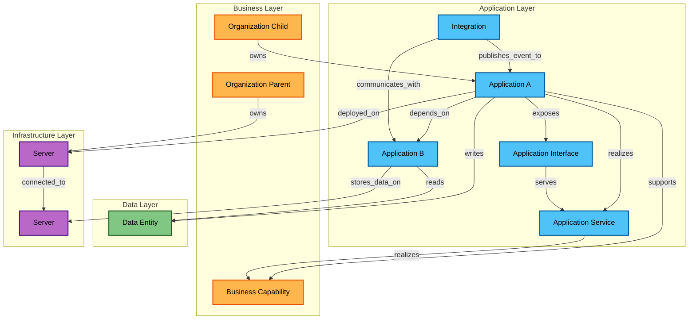

# Relationship Modeling Guide

This guide explains how to model relationships between entities using the `Relation` resource.

## Overview

Relations are typed, directed edges that connect two entities with specific semantic meaning. Each relation has:
- **Source** and **Target**: The entities being connected
- **Relation Type**: The semantic relationship (e.g., `depends_on`, `realizes`)
- **ArchiMate Mapping**: Optional mapping to ArchiMate 3.2 relationship types
- **Governance Metadata**: Confidence, evidence, verification timestamps
- **Rendering Hints**: Label, color, style for visualization

## Relationship Model Diagram

The following diagram illustrates the key relationship types and how different entities connect:



## Relation Types

### Application Layer Relations

#### `depends_on`
**Meaning**: Source application requires target application to function.

**Valid Pairs**: application → application

**Example**: Frontend app depends on backend API
```json
{
  "source_id": "app-frontend",
  "target_id": "app-backend-api",
  "source_type": "application",
  "target_type": "application",
  "relation_type": "depends_on",
  "archimate_relationship": "Serving",
  "confidence": 0.9,
  "evidence_source": "cmdb"
}
```

#### `communicates_with`
**Meaning**: Bidirectional communication between applications.

**Valid Pairs**: 
- application → application
- integration → application

**Example**: Two microservices communicate via REST
```json
{
  "source_id": "app-orders",
  "target_id": "app-inventory",
  "source_type": "application",
  "target_type": "application",
  "relation_type": "communicates_with",
  "archimate_relationship": "Flow",
  "bidirectional": true
}
```

#### `calls`
**Meaning**: Source invokes target API/interface.

**Valid Pairs**:
- application → application (direct calls)

**Example**: Application exposes payment interface
```json
{
  "source_id": "app-checkout",
  "target_id": "intf-payment-api",
  "source_type": "application",
  "target_type": "application_interface",
  "relation_type": "exposes",
  "archimate_relationship": "Serving"
}
```

#### `publishes_event_to` / `consumes_event_from`
**Meaning**: Event-driven communication via message bus or pub/sub.

**Valid Pairs**:
- integration → application

**Example**: Event bus publishes order events to an application
```json
{
  "source_id": "int-orders-bus",
  "target_id": "app-notifications",
  "source_type": "integration",
  "target_type": "application",
  "relation_type": "publishes_event_to",
  "archimate_relationship": "Triggering",
  "description": "Publishes order.created events to Kafka"
}
```

### Infrastructure Relations

#### `deployed_on`
**Meaning**: Application is deployed/runs on server.

**Valid Pairs**: application → server

**ArchiMate**: `Assignment` (application assigned to node)

**Example**: Web app deployed on Kubernetes cluster
```json
{
  "source_id": "app-web",
  "target_id": "srv-k8s-prod-01",
  "source_type": "application",
  "target_type": "server",
  "relation_type": "deployed_on",
  "archimate_relationship": "Assignment"
}
```

#### `stores_data_on`
**Meaning**: Application stores data on server/database.

**Valid Pairs**: application → server

**Example**: Application uses database server
```json
{
  "source_id": "app-billing",
  "target_id": "srv-db-prod-01",
  "source_type": "application",
  "target_type": "server",
  "relation_type": "stores_data_on",
  "archimate_relationship": "Assignment"
}
```

#### `connected_to`
**Meaning**: Network or physical connection between servers.

**Valid Pairs**: server → server

**Example**: Database replication
```json
{
  "source_id": "srv-db-primary",
  "target_id": "srv-db-replica",
  "source_type": "server",
  "target_type": "server",
  "relation_type": "connected_to",
  "archimate_relationship": "Association"
}
```

### Data Access Relations

#### `reads` / `writes`
**Meaning**: Application reads or writes a data entity.

**Valid Pairs**: application → data_entity

**ArchiMate**: `Access` (read or write)

**Example**: CRM writes customer data
```json
{
  "source_id": "app-crm",
  "target_id": "data-customer-profile",
  "source_type": "application",
  "target_type": "data_entity",
  "relation_type": "writes",
  "archimate_relationship": "Access",
  "data_classification": "confidential"
}
```

### Service Layer Relations

#### `realizes`
**Meaning**: Application realizes/implements a service, or service realizes a business capability.

**Valid Pairs**: 
- application → application_service
- application_service → business_capability

**ArchiMate**: `Realization` (implementation of abstraction)

**Example**: Billing app realizes payment service
```json
{
  "source_id": "app-billing-api",
  "target_id": "svc-payment",
  "source_type": "application",
  "target_type": "application_service",
  "relation_type": "realizes",
  "archimate_relationship": "Realization"
}
```

#### `exposes`
**Meaning**: Application exposes an interface for access.

**Valid Pairs**: application → application_interface

**ArchiMate**: `Assignment` or `Composition`

**Example**: API application exposes REST interface
```json
{
  "source_id": "app-billing-api",
  "target_id": "intf-payment-api-v2",
  "source_type": "application",
  "target_type": "application_interface",
  "relation_type": "exposes",
  "archimate_relationship": "Composition"
}
```

### Organization Hierarchy
Organizational hierarchy is modeled using the `parent_id` field on the Organization entity. Relations are not used for org→org hierarchy in the current backend. Use `parent_id` for efficient hierarchy queries; model ownership via `organization → owns → {application|server}` relations where appropriate.
#### `uses`
**Meaning**: Application or integration uses a service or interface.

**Valid Pairs**: 
- application → application_service
- integration → application_interface

**ArchiMate**: `Serving` (reverse of serves)

**Example**: Checkout app uses payment service
```json
{
  "source_id": "app-checkout",
  "target_id": "svc-payment",
  "source_type": "application",
  "target_type": "application_service",
  "relation_type": "uses",
  "archimate_relationship": "Serving"
}
```

### Business Layer Relations

#### `supports`
**Meaning**: Application or service supports a business capability.

**Valid Pairs**: 
- application → business_capability
- application_service → business_capability

**ArchiMate**: `Realization` or `Serving`

**Example**: CRM supports customer management
```json
{
  "source_id": "app-crm",
  "target_id": "cap-customer-mgmt",
  "source_type": "application",
  "target_type": "business_capability",
  "relation_type": "supports",
  "archimate_relationship": "Realization"
}
```

#### `owns`
**Meaning**: Organization owns an asset.

**Valid Pairs**: 
- organization → application
- organization → server

**ArchiMate**: `Assignment` or `Composition`

**Example**: Payments team owns billing app
```json
{
  "source_id": "org-payments-team",
  "target_id": "app-billing",
  "source_type": "organization",
  "target_type": "application",
  "relation_type": "owns",
  "archimate_relationship": "Assignment"
}
```

### Organizational Relations

#### `part_of`
**Meaning**: Organization is part of a parent organization (hierarchical structure).

**Valid Pairs**: organization → organization

**ArchiMate**: `Aggregation` or `Composition`

**Example**: Payments team is part of Engineering division
```json
{
  "source_id": "org-payments-team",
  "target_id": "org-engineering-div",
  "source_type": "organization",
  "target_type": "organization",
  "relation_type": "part_of",
  "archimate_relationship": "Aggregation",
  "description": "Payments team reports to Engineering division"
}
```

**Note**: The `parent_id` field on the Organization entity provides the same hierarchical relationship. Use `part_of` relations when you need additional metadata (confidence, effective dates, custom labels) or want to model the hierarchy explicitly in the relations graph. Use `parent_id` for simple, efficient hierarchy queries.

## Validation Rules

The system enforces valid relation type and entity type combinations. Invalid combinations return `422 ValidationError`.

### Allowed Pairs Matrix

The backend enforces a strict set of valid source/target/relation combinations:

| Source Type | Target Type | Allowed Relation Types |
|-------------|-------------|------------------------|
| application | application | depends_on, communicates_with, calls |
| application | application_service | realizes, uses |
| application | application_interface | exposes |
| application | server | deployed_on, stores_data_on |
| application | data_entity | reads, writes |
| application | business_capability | supports |
| application_service | business_capability | realizes, supports |
| application_interface | application_service | serves |
| integration | application | communicates_with, publishes_event_to, consumes_event_from |
| server | server | connected_to |
| organization | application | owns |
| organization | server | owns |

## Governance Metadata

Relations support rich metadata for governance and confidence tracking:

```json
{
  "source_id": "app-checkout",
  "target_id": "app-billing-api",
  "source_type": "application",
  "target_type": "application",
  "relation_type": "depends_on",
  
  "description": "Checkout calls billing API for payment processing",
  "data_classification": "confidential",
  "criticality": "high",
  
  "confidence": 0.85,
  "evidence_source": "cmdb-sync-job",
  "last_verified_at": "2024-01-05T10:00:00Z",
  
  "effective_from": "2024-01-01T00:00:00Z",
  "effective_to": null,
  
  "label": "Payment Dependency",
  "color": "#FF5722",
  "style": "solid",
  "bidirectional": false
}
```

## Best Practices

### 1. Use Specific Relation Types
Prefer specific types (`reads`, `writes`) over generic ones (`connected_to`) for clarity.

### 2. Track Confidence
Set `confidence` and `evidence_source` to indicate data quality:
- `1.0`: Manually verified or actively monitored
- `0.8-0.9`: Automatically discovered with high confidence
- `0.5-0.7`: Inferred or partially verified
- `<0.5`: Low confidence, needs review

### 3. Verify Regularly
Update `last_verified_at` when relationships are confirmed to be accurate.

### 4. Use Temporal Validity
Set `effective_from` and `effective_to` for planned or historical relationships:
```json
{
  "relation_type": "deployed_on",
  "effective_from": "2024-01-15T00:00:00Z",
  "effective_to": "2024-06-30T23:59:59Z",
  "description": "Temporary deployment during migration"
}
```

### 5. Add Context
Use `description` to explain non-obvious relationships, especially for complex dependencies.

### 6. Classify Sensitive Relations
Set `data_classification` for relationships involving data flows with sensitive information.

### 7. ArchiMate Alignment
Map to ArchiMate relationship types for proper visualization:
- **Structural**: Composition, Aggregation, Assignment, Realization
- **Dependency**: Serving, Access, Influence
- **Dynamic**: Flow, Triggering
- **Other**: Specialization, Association

## Common Patterns

### Service-Oriented Architecture
```
Application → realizes → ApplicationService
Application → exposes → ApplicationInterface
ApplicationInterface → serves → ApplicationService
ApplicationService → realizes → BusinessCapability
```

### Deployment Model
```
Organization → owns → Application
Application → deployed_on → Server
Application → stores_data_on → Server
Server → connected_to → Server
```

### Data Lineage
```
Application → reads → DataEntity (raw)
Application → writes → DataEntity (processed)
DataEntity.lineage = [raw-data-entity-id]
```

### Integration Chain
```
Integration → communicates_with → Application
Integration → publishes_event_to → Application
ApplicationInterface → serves → ApplicationService
```

## Next Steps

- [ArchiMate Alignment](./archimate-alignment.md) - Understand ArchiMate mapping
- [API Usage Guide](./api-usage-guide.md) - How to create relations via API
